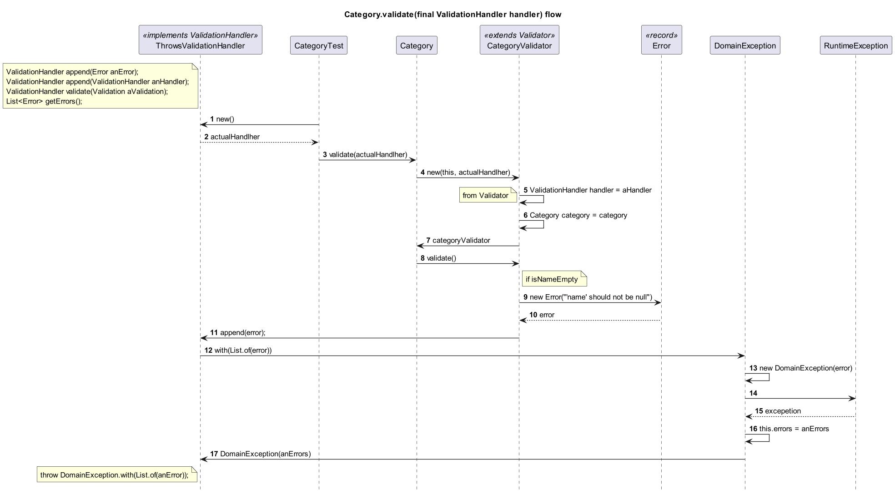
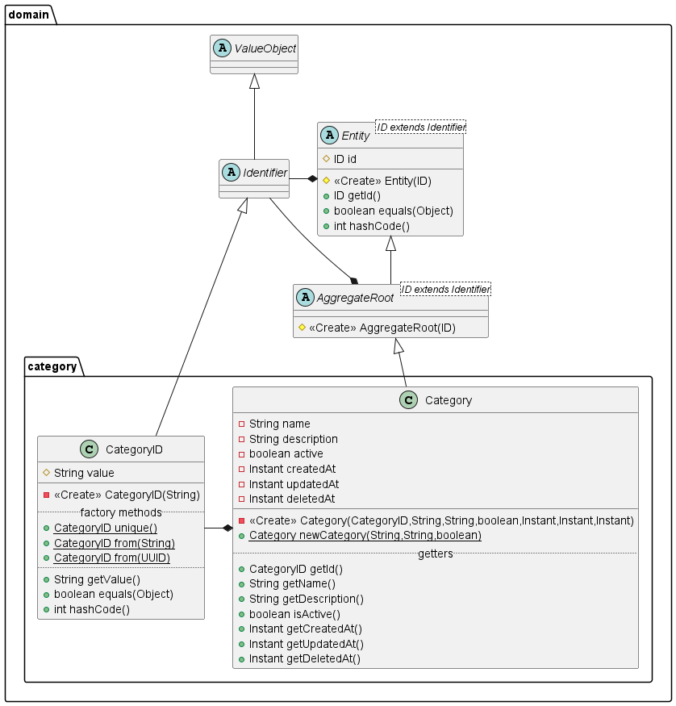

# DDD

# Tools
https://www.planttext.com/

https://www.plantuml.com/

## Main classes

## Domínio de Categoria

- Filmes
- Séries
- Documentários
- etc

## Entity Validations
- Entities knows how to self validate

- [Notification patter - Fowler](https://martinfowler.com/eaaDev/Notification.html)
  - _"You should use Notification whenever validation is done by a layer of code that cannot have a direct dependency to the module that initiates the validation."_
  - _"It's usually more helpful to show every validation error, particular if validation requires a round trip to a remote domain layer."_
- Implementing Domain-Driven Design
  - Chapter 5 Entities - Discovering Entities and Their Intrinsic Characteristics - Validation
- [Notification Pattern no DDD](https://www.anselme.com.br/2023/06/28/notification-pattern-no-ddd/)
- [Validation Pattern no Domain Driven Design](https://www.anselme.com.br/2023/04/12/validation-pattern-no-domain-driven-design/)
- [Notification Pattern – Estão te vendendo um conceito errado](https://gago.io/blog/2019-04-28-notification-pattern/)
- [Não lance Exceptions em seu Domínio… Use Notifications!](https://www.wellingtonjhn.com/posts/n%C3%A3o-lance-exceptions-em-seu-dom%C3%ADnio-use-notifications/)

- [Fluent interface - Fowler](https://martinfowler.com/bliki/FluentInterface.html)
- [Fluent interface - Wikipedia](https://en.wikipedia.org/wiki/Fluent_interface)
- [Difference Between Fluent Interface and Builder Pattern in Java](https://www.baeldung.com/java-fluent-interface-vs-builder-pattern)
- 