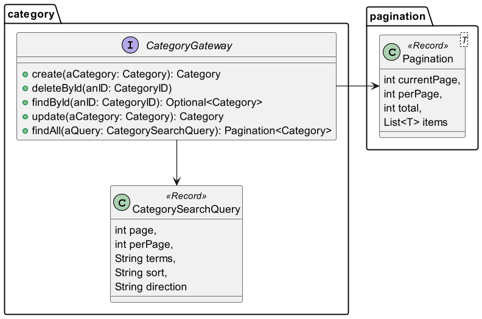

# Project developed using DDD tactical patterns concepts

# Tools
## Raw
- https://www.planttext.com/
- https://www.plantuml.com/

## IntelliJ Plugins
- [PlantUML Integration](https://plugins.jetbrains.com/plugin/7017-plantuml-integration)
- [PlantUML Parser](https://plugins.jetbrains.com/plugin/15524-plantuml-parser)

# Main domain classes (DDD)


# Catalog domain


- Filmes
- Séries
- Documentários
- etc

# Entity Validations
- Entities knows how to self validate


```
é criado um objeto Category
é criado um objeto ThrowsValidationHandler que implements ValidationHandler

o teste chama o método validate de category
Category recebe como parâmetro o objeto ValidationHandler

no metodo validate de category é criado um objeto CategoryValidator que extends Validator
CategoryValidator recebe como parâmetros o objeto category que o invocou e o objeto ValidationHandler recebido de teste
Validator possui uma propriedade handler
handler guarda o objeto ValidationHandler passado inicialmente pelo teste
o método validate chama então o método validate de CategoryValidator

o método validate de CategoryValidator fará então as checagens necessárias
por ex, verifica se o nome da categoria é nula e se for
cria um novo Error que é um record recebendo a mensagem de erro "'name' should not be null"
chama o método append do seu handler (aqui ThrowsValidationHandler) passando este erro

no método append de ThrowsValidationHandler

chama o método with de DomainException passando uma lista contendo o erro
o método with chama o construtor privado de DomainException passando a lista de erros
DomainException extends RuntimeException
o construtor chama o super de RuntimeException
DomainException possui uma lista erros
o construtor atribui a lista recebida contendo error para sua lista interna
o método with encerra retornando este novo objeto DomainException criado

será lançada uma exceção DomainException.with(List.of(anError))


a execução volta para o método append ThrowsValidationHandler
será lançada a exceção com o DomainException recebido

a execução volta pro teste por causa da exception

actualException recebe a exceção DomainException que contem a lista de erros
```

# Gateway



# References
- [Notification patter - Fowler](https://martinfowler.com/eaaDev/Notification.html)
  - _"You should use Notification whenever validation is done by a layer of code that cannot have a direct dependency to the module that initiates the validation."_
  - _"It's usually more helpful to show every validation error, particular if validation requires a round trip to a remote domain layer."_
- Implementing Domain-Driven Design
  - Chapter 5 Entities - Discovering Entities and Their Intrinsic Characteristics - Validation
- [Notification Pattern no DDD](https://www.anselme.com.br/2023/06/28/notification-pattern-no-ddd/)
- [Validation Pattern no Domain Driven Design](https://www.anselme.com.br/2023/04/12/validation-pattern-no-domain-driven-design/)
- [Notification Pattern – Estão te vendendo um conceito errado](https://gago.io/blog/2019-04-28-notification-pattern/)
- [Não lance Exceptions em seu Domínio… Use Notifications!](https://www.wellingtonjhn.com/posts/n%C3%A3o-lance-exceptions-em-seu-dom%C3%ADnio-use-notifications/)


- [Fluent interface - Fowler](https://martinfowler.com/bliki/FluentInterface.html)
- [Fluent interface - Wikipedia](https://en.wikipedia.org/wiki/Fluent_interface)
- [Difference Between Fluent Interface and Builder Pattern in Java](https://www.baeldung.com/java-fluent-interface-vs-builder-pattern)
- 